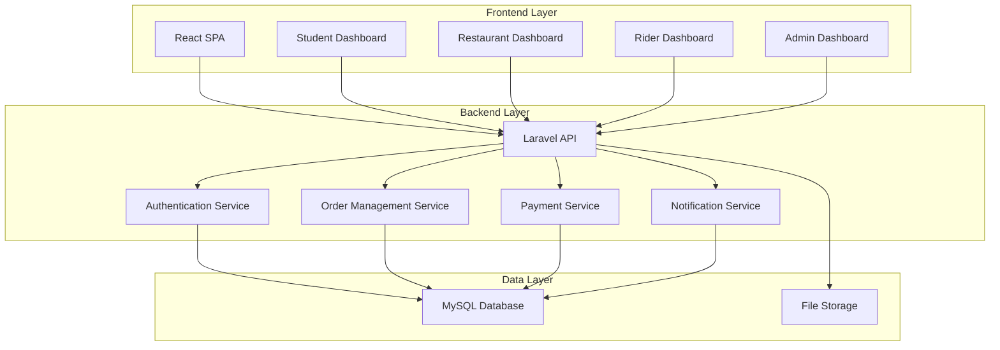

# Design Document: UniBite Food Delivery System

## Overview

UniBite is a campus food delivery system built with Laravel 12 backend API and React frontend. The system facilitates food ordering and delivery within university campuses, connecting students, restaurants (cafeterias), delivery riders, and administrators through a web-based platform.

The architecture follows a RESTful API design pattern with role-based access control, real-time order tracking, and secure payment processing.

## Architecture

### System Architecture



### Technology Stack

- **Backend**: Laravel 12 with PHP 8.2+
- **Frontend**: React 18 with JavaScript
- **Database**: MySQL 8.0+
- **Authentication**: Laravel Sanctum
- **API**: RESTful API with JSON responses
- **File Storage**: Local storage for images
- **Development**: Vite for frontend bundling

## Components and Interfaces

### Backend Components

#### 1. Authentication System
- **Purpose**: Handle user registration, login, and role-based access
- **Technologies**: Laravel Sanctum, JWT tokens
- **Endpoints**:
  - `POST /api/auth/register`
  - `POST /api/auth/login`
  - `POST /api/auth/logout`
  - `GET /api/user`

#### 2. User Management
- **Purpose**: Manage different user types and their profiles
- **Models**: User, Student, Restaurant, Rider, Admin
- **Endpoints**:
  - `GET /api/users`
  - `PUT /api/users/{id}`
  - `DELETE /api/users/{id}`

#### 3. Menu Management
- **Purpose**: Handle menu items, categories, and availability
- **Models**: Category, MenuItem
- **Endpoints**:
  - `GET /api/categories`
  - `GET /api/menu-items`
  - `POST /api/menu-items`
  - `PUT /api/menu-items/{id}`
  - `DELETE /api/menu-items/{id}`

#### 4. Order Management
- **Purpose**: Process orders from placement to delivery
- **Models**: Order, OrderItem, Cart
- **Endpoints**:
  - `POST /api/orders`
  - `GET /api/orders`
  - `GET /api/orders/{id}`
  - `PUT /api/orders/{id}/status`
  - `POST /api/cart/add`
  - `GET /api/cart`

#### 5. Payment System
- **Purpose**: Handle payment processing and records
- **Models**: Payment
- **Endpoints**:
  - `POST /api/payments`
  - `GET /api/payments/{orderId}`

#### 6. Delivery Management
- **Purpose**: Manage delivery assignments and tracking
- **Models**: Delivery
- **Endpoints**:
  - `GET /api/deliveries/available`
  - `POST /api/deliveries/{id}/accept`
  - `PUT /api/deliveries/{id}/status`

### Frontend Components

#### 1. Student Interface
- **Components**:
  - MenuBrowser: Display food categories and items
  - Cart: Shopping cart management
  - OrderPlacement: Order confirmation and delivery details
  - OrderTracking: Real-time order status
  - OrderHistory: Past orders display

#### 2. Restaurant Interface
- **Components**:
  - MenuManagement: CRUD operations for menu items
  - OrderQueue: Incoming orders management
  - OrderStatus: Update preparation status

#### 3. Rider Interface
- **Components**:
  - DeliveryQueue: Available delivery requests
  - ActiveDelivery: Current delivery management
  - DeliveryHistory: Past deliveries

#### 4. Admin Interface
- **Components**:
  - UserManagement: Manage all user types
  - SystemReports: Analytics and reporting
  - SystemSettings: Configuration management

## Data Models

### User Model
```php
class User extends Authenticatable
{
    protected $fillable = [
        'name', 'email', 'password', 'phone', 'role', 'status'
    ];
    
    protected $hidden = [
        'password', 'remember_token'
    ];
    
    protected $casts = [
        'email_verified_at' => 'datetime',
        'password' => 'hashed'
    ];
}
```

### Category Model
```php
class Category extends Model
{
    protected $fillable = [
        'name', 'description', 'image', 'status'
    ];
    
    public function menuItems()
    {
        return $this->hasMany(MenuItem::class);
    }
}
```

### MenuItem Model
```php
class MenuItem extends Model
{
    protected $fillable = [
        'category_id', 'restaurant_id', 'name', 'description', 
        'price', 'image', 'is_available'
    ];
    
    protected $casts = [
        'price' => 'decimal:2',
        'is_available' => 'boolean'
    ];
    
    public function category()
    {
        return $this->belongsTo(Category::class);
    }
    
    public function restaurant()
    {
        return $this->belongsTo(User::class, 'restaurant_id');
    }
}
```

### Order Model
```php
class Order extends Model
{
    protected $fillable = [
        'student_id', 'restaurant_id', 'total_amount', 'delivery_address',
        'status', 'payment_method', 'payment_status', 'notes'
    ];
    
    protected $casts = [
        'total_amount' => 'decimal:2'
    ];
    
    public function student()
    {
        return $this->belongsTo(User::class, 'student_id');
    }
    
    public function restaurant()
    {
        return $this->belongsTo(User::class, 'restaurant_id');
    }
    
    public function items()
    {
        return $this->hasMany(OrderItem::class);
    }
    
    public function delivery()
    {
        return $this->hasOne(Delivery::class);
    }
    
    public function payment()
    {
        return $this->hasOne(Payment::class);
    }
}
```

### OrderItem Model
```php
class OrderItem extends Model
{
    protected $fillable = [
        'order_id', 'menu_item_id', 'quantity', 'unit_price', 'total_price'
    ];
    
    protected $casts = [
        'unit_price' => 'decimal:2',
        'total_price' => 'decimal:2'
    ];
    
    public function order()
    {
        return $this->belongsTo(Order::class);
    }
    
    public function menuItem()
    {
        return $this->belongsTo(MenuItem::class);
    }
}
```

### Delivery Model
```php
class Delivery extends Model
{
    protected $fillable = [
        'order_id', 'rider_id', 'pickup_time', 'delivery_time',
        'status', 'notes'
    ];
    
    protected $casts = [
        'pickup_time' => 'datetime',
        'delivery_time' => 'datetime'
    ];
    
    public function order()
    {
        return $this->belongsTo(Order::class);
    }
    
    public function rider()
    {
        return $this->belongsTo(User::class, 'rider_id');
    }
}
```

### Payment Model
```php
class Payment extends Model
{
    protected $fillable = [
        'order_id', 'amount', 'payment_method', 'transaction_id',
        'status', 'processed_at'
    ];
    
    protected $casts = [
        'amount' => 'decimal:2',
        'processed_at' => 'datetime'
    ];
    
    public function order()
    {
        return $this->belongsTo(Order::class);
    }
}
```

## Database Schema

### Tables Structure

```sql
-- Users table (handles all user types)
CREATE TABLE users (
    id BIGINT UNSIGNED AUTO_INCREMENT PRIMARY KEY,
    name VARCHAR(255) NOT NULL,
    email VARCHAR(255) UNIQUE NOT NULL,
    phone VARCHAR(20),
    password VARCHAR(255) NOT NULL,
    role ENUM('student', 'restaurant', 'rider', 'admin') NOT NULL,
    status ENUM('active', 'inactive', 'suspended') DEFAULT 'active',
    email_verified_at TIMESTAMP NULL,
    created_at TIMESTAMP DEFAULT CURRENT_TIMESTAMP,
    updated_at TIMESTAMP DEFAULT CURRENT_TIMESTAMP ON UPDATE CURRENT_TIMESTAMP
);

-- Categories table
CREATE TABLE categories (
    id BIGINT UNSIGNED AUTO_INCREMENT PRIMARY KEY,
    name VARCHAR(255) NOT NULL,
    description TEXT,
    image VARCHAR(255),
    status ENUM('active', 'inactive') DEFAULT 'active',
    created_at TIMESTAMP DEFAULT CURRENT_TIMESTAMP,
    updated_at TIMESTAMP DEFAULT CURRENT_TIMESTAMP ON UPDATE CURRENT_TIMESTAMP
);

-- Menu items table
CREATE TABLE menu_items (
    id BIGINT UNSIGNED AUTO_INCREMENT PRIMARY KEY,
    category_id BIGINT UNSIGNED NOT NULL,
    restaurant_id BIGINT UNSIGNED NOT NULL,
    name VARCHAR(255) NOT NULL,
    description TEXT,
    price DECIMAL(8,2) NOT NULL,
    image VARCHAR(255),
    is_available BOOLEAN DEFAULT TRUE,
    created_at TIMESTAMP DEFAULT CURRENT_TIMESTAMP,
    updated_at TIMESTAMP DEFAULT CURRENT_TIMESTAMP ON UPDATE CURRENT_TIMESTAMP,
    FOREIGN KEY (category_id) REFERENCES categories(id) ON DELETE CASCADE,
    FOREIGN KEY (restaurant_id) REFERENCES users(id) ON DELETE CASCADE
);

-- Orders table
CREATE TABLE orders (
    id BIGINT UNSIGNED AUTO_INCREMENT PRIMARY KEY,
    student_id BIGINT UNSIGNED NOT NULL,
    restaurant_id BIGINT UNSIGNED NOT NULL,
    total_amount DECIMAL(10,2) NOT NULL,
    delivery_address TEXT NOT NULL,
    status ENUM('pending', 'accepted', 'preparing', 'ready', 'out_for_delivery', 'delivered', 'cancelled') DEFAULT 'pending',
    payment_method ENUM('cash_on_delivery', 'mobile_payment', 'digital_wallet') NOT NULL,
    payment_status ENUM('pending', 'paid', 'failed', 'refunded') DEFAULT 'pending',
    notes TEXT,
    created_at TIMESTAMP DEFAULT CURRENT_TIMESTAMP,
    updated_at TIMESTAMP DEFAULT CURRENT_TIMESTAMP ON UPDATE CURRENT_TIMESTAMP,
    FOREIGN KEY (student_id) REFERENCES users(id) ON DELETE CASCADE,
    FOREIGN KEY (restaurant_id) REFERENCES users(id) ON DELETE CASCADE
);

-- Order items table
CREATE TABLE order_items (
    id BIGINT UNSIGNED AUTO_INCREMENT PRIMARY KEY,
    order_id BIGINT UNSIGNED NOT NULL,
    menu_item_id BIGINT UNSIGNED NOT NULL,
    quantity INT NOT NULL,
    unit_price DECIMAL(8,2) NOT NULL,
    total_price DECIMAL(8,2) NOT NULL,
    created_at TIMESTAMP DEFAULT CURRENT_TIMESTAMP,
    updated_at TIMESTAMP DEFAULT CURRENT_TIMESTAMP ON UPDATE CURRENT_TIMESTAMP,
    FOREIGN KEY (order_id) REFERENCES orders(id) ON DELETE CASCADE,
    FOREIGN KEY (menu_item_id) REFERENCES menu_items(id) ON DELETE CASCADE
);

-- Deliveries table
CREATE TABLE deliveries (
    id BIGINT UNSIGNED AUTO_INCREMENT PRIMARY KEY,
    order_id BIGINT UNSIGNED NOT NULL,
    rider_id BIGINT UNSIGNED,
    pickup_time TIMESTAMP NULL,
    delivery_time TIMESTAMP NULL,
    status ENUM('pending', 'assigned', 'picked_up', 'delivered') DEFAULT 'pending',
    notes TEXT,
    created_at TIMESTAMP DEFAULT CURRENT_TIMESTAMP,
    updated_at TIMESTAMP DEFAULT CURRENT_TIMESTAMP ON UPDATE CURRENT_TIMESTAMP,
    FOREIGN KEY (order_id) REFERENCES orders(id) ON DELETE CASCADE,
    FOREIGN KEY (rider_id) REFERENCES users(id) ON DELETE SET NULL
);

-- Payments table
CREATE TABLE payments (
    id BIGINT UNSIGNED AUTO_INCREMENT PRIMARY KEY,
    order_id BIGINT UNSIGNED NOT NULL,
    amount DECIMAL(10,2) NOT NULL,
    payment_method ENUM('cash_on_delivery', 'mobile_payment', 'digital_wallet') NOT NULL,
    transaction_id VARCHAR(255),
    status ENUM('pending', 'completed', 'failed', 'refunded') DEFAULT 'pending',
    processed_at TIMESTAMP NULL,
    created_at TIMESTAMP DEFAULT CURRENT_TIMESTAMP,
    updated_at TIMESTAMP DEFAULT CURRENT_TIMESTAMP ON UPDATE CURRENT_TIMESTAMP,
    FOREIGN KEY (order_id) REFERENCES orders(id) ON DELETE CASCADE
);
```
## Correctness Properties

*A property is a characteristic or behavior that should hold true across all valid executions of a system-essentially, a formal statement about what the system should do. Properties serve as the bridge between human-readable specifications and machine-verifiable correctness guarantees.*

### Property 1: User Registration Integrity
*For any* valid user registration data (name, email, password, phone), the system should create a user account with all fields properly stored and passwords encrypted.
**Validates: Requirements 1.1, 1.4**

### Property 2: Authentication Security
*For any* user with valid credentials, authentication should succeed, and for any invalid credentials, authentication should fail with appropriate error messages.
**Validates: Requirements 1.2, 1.3**

### Property 3: Email Uniqueness
*For any* email address, only one user account should be allowed to register with that email address.
**Validates: Requirements 1.5**

### Property 4: Menu Item Organization
*For any* set of menu items with categories, items should be properly grouped by their assigned categories when displayed.
**Validates: Requirements 2.1**

### Property 5: Menu Item Completeness
*For any* menu item displayed to students, all required fields (name, price, description, availability) should be present and accurate.
**Validates: Requirements 2.2**

### Property 6: Menu Availability Filtering
*For any* menu query by students, only items marked as available should be returned in the results.
**Validates: Requirements 2.4**

### Property 7: Cart Management Accuracy
*For any* cart operations (add, modify, remove), the cart contents and total price should be calculated correctly.
**Validates: Requirements 3.1, 3.2**

### Property 8: Order Placement Validation
*For any* order placement attempt, the system should require a valid campus delivery location and non-empty cart.
**Validates: Requirements 3.3, 3.5**

### Property 9: Order ID Uniqueness
*For any* set of orders placed in the system, each order should have a unique identifier.
**Validates: Requirements 3.4**

### Property 10: Payment Method Support
*For any* valid payment method (cash on delivery, mobile payment, digital wallet), the system should accept and properly record the payment.
**Validates: Requirements 4.1, 4.2, 4.3, 4.4**

### Property 11: Order Status Management
*For any* order status change (accept, reject, prepare, ready, deliver), the system should update the status correctly and maintain status consistency.
**Validates: Requirements 5.2, 5.3, 5.5, 6.3, 6.4**

### Property 12: Delivery Assignment Exclusivity
*For any* delivery request, only one rider should be able to accept and be assigned to that delivery.
**Validates: Requirements 6.2, 6.5**

### Property 13: Order Tracking Accuracy
*For any* order in the system, the tracking information should accurately reflect the current status and be updated immediately when status changes.
**Validates: Requirements 7.1, 7.2, 7.4, 7.5**

### Property 14: Menu Item CRUD Operations
*For any* restaurant performing menu item operations (create, read, update, delete), the operations should be properly executed and reflected in the system.
**Validates: Requirements 9.1, 9.2, 9.3, 9.4**

### Property 15: Campus Location Validation
*For any* delivery address provided, the system should only accept addresses within the defined campus boundaries.
**Validates: Requirements 10.1, 10.2, 10.5**

## Error Handling

### Authentication Errors
- Invalid credentials return 401 Unauthorized
- Missing authentication token returns 401 Unauthorized
- Expired tokens return 401 Unauthorized
- Insufficient permissions return 403 Forbidden

### Validation Errors
- Missing required fields return 422 Unprocessable Entity
- Invalid data formats return 422 Unprocessable Entity
- Business rule violations return 400 Bad Request

### Resource Errors
- Non-existent resources return 404 Not Found
- Duplicate resources return 409 Conflict
- Server errors return 500 Internal Server Error

### Order Processing Errors
- Invalid menu items return 400 Bad Request
- Unavailable items return 409 Conflict
- Invalid delivery locations return 422 Unprocessable Entity
- Payment failures return 402 Payment Required

## Testing Strategy

### Dual Testing Approach
The system will use both unit tests and property-based tests for comprehensive coverage:

- **Unit tests**: Verify specific examples, edge cases, and error conditions
- **Property tests**: Verify universal properties across all inputs
- Both are complementary and necessary for comprehensive coverage

### Unit Testing Focus
- Specific examples that demonstrate correct behavior
- Integration points between components
- Edge cases and error conditions
- API endpoint responses and status codes

### Property-Based Testing Focus
- Universal properties that hold for all inputs
- Comprehensive input coverage through randomization
- Business rule validation across various scenarios
- Data integrity and consistency checks

### Property Test Configuration
- Minimum 100 iterations per property test
- Each property test references its design document property
- Tag format: **Feature: unibite-food-delivery, Property {number}: {property_text}**
- Use Laravel's built-in testing framework with custom property test helpers

### Testing Framework
- **Backend**: Laravel's PHPUnit with custom property testing utilities
- **Frontend**: Jest with React Testing Library
- **API Testing**: Laravel Feature Tests
- **Database Testing**: Laravel's database testing utilities with factories and seeders