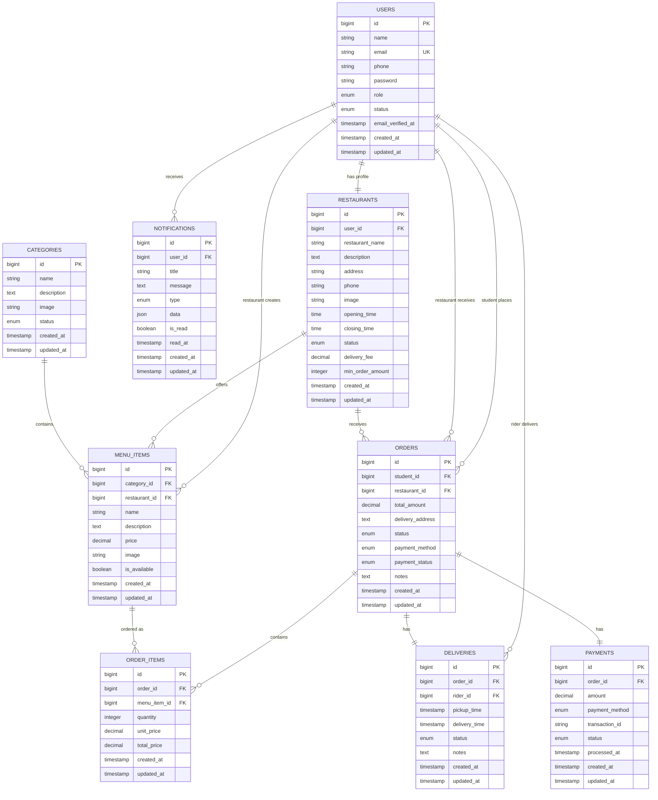

# UniBite Database Schema

## Overview
This document outlines the complete database schema for the UniBite campus food delivery system. The schema supports multi-role users (students, restaurants, riders, admins), menu management, order processing, delivery tracking, and payment handling.

## Entity Relationship Diagram

## Table Definitions

### 1. USERS Table
**Purpose**: Stores all user types (students, restaurants, riders, admins) in a single table with role-based differentiation.

| Column | Type | Constraints | Description |
|--------|------|-------------|-------------|
| id | BIGINT UNSIGNED | PRIMARY KEY, AUTO_INCREMENT | Unique user identifier |
| name | VARCHAR(255) | NOT NULL | User's full name |
| email | VARCHAR(255) | NOT NULL, UNIQUE | User's email address |
| phone | VARCHAR(20) | NULLABLE | User's phone number |
| password | VARCHAR(255) | NOT NULL | Hashed password |
| role | ENUM | NOT NULL, DEFAULT 'student' | User role: student, restaurant, rider, admin |
| status | ENUM | DEFAULT 'active' | Account status: active, inactive, suspended |
| email_verified_at | TIMESTAMP | NULLABLE | Email verification timestamp |
| created_at | TIMESTAMP | DEFAULT CURRENT_TIMESTAMP | Record creation time |
| updated_at | TIMESTAMP | DEFAULT CURRENT_TIMESTAMP ON UPDATE | Last update time |

**Indexes**:
- PRIMARY KEY (id)
- UNIQUE KEY (email)
- INDEX (role)
- INDEX (status)

### 2. CATEGORIES Table
**Purpose**: Stores food categories for organizing menu items.

| Column | Type | Constraints | Description |
|--------|------|-------------|-------------|
| id | BIGINT UNSIGNED | PRIMARY KEY, AUTO_INCREMENT | Unique category identifier |
| name | VARCHAR(255) | NOT NULL | Category name |
| description | TEXT | NULLABLE | Category description |
| image | VARCHAR(255) | NULLABLE | Category image path |
| status | ENUM | DEFAULT 'active' | Category status: active, inactive |
| created_at | TIMESTAMP | DEFAULT CURRENT_TIMESTAMP | Record creation time |
| updated_at | TIMESTAMP | DEFAULT CURRENT_TIMESTAMP ON UPDATE | Last update time |

**Indexes**:
- PRIMARY KEY (id)
- INDEX (status)

### 3. MENU_ITEMS Table
**Purpose**: Stores individual food items available for ordering.

| Column | Type | Constraints | Description |
|--------|------|-------------|-------------|
| id | BIGINT UNSIGNED | PRIMARY KEY, AUTO_INCREMENT | Unique menu item identifier |
| category_id | BIGINT UNSIGNED | NOT NULL, FOREIGN KEY | Reference to categories table |
| restaurant_id | BIGINT UNSIGNED | NOT NULL, FOREIGN KEY | Reference to users table (restaurant) |
| name | VARCHAR(255) | NOT NULL | Menu item name |
| description | TEXT | NULLABLE | Item description |
| price | DECIMAL(8,2) | NOT NULL | Item price |
| image | VARCHAR(255) | NULLABLE | Item image path |
| is_available | BOOLEAN | DEFAULT TRUE | Availability status |
| created_at | TIMESTAMP | DEFAULT CURRENT_TIMESTAMP | Record creation time |
| updated_at | TIMESTAMP | DEFAULT CURRENT_TIMESTAMP ON UPDATE | Last update time |

**Foreign Keys**:
- category_id REFERENCES categories(id) ON DELETE CASCADE
- restaurant_id REFERENCES users(id) ON DELETE CASCADE

**Indexes**:
- PRIMARY KEY (id)
- INDEX (category_id)
- INDEX (restaurant_id)
- INDEX (is_available)

### 6. ORDERS Table
**Purpose**: Stores order information and tracks order lifecycle.

| Column | Type | Constraints | Description |
|--------|------|-------------|-------------|
| id | BIGINT UNSIGNED | PRIMARY KEY, AUTO_INCREMENT | Unique order identifier |
| student_id | BIGINT UNSIGNED | NOT NULL, FOREIGN KEY | Reference to users table (student) |
| restaurant_id | BIGINT UNSIGNED | NOT NULL, FOREIGN KEY | Reference to users table (restaurant) |
| total_amount | DECIMAL(10,2) | NOT NULL | Total order amount |
| delivery_address | TEXT | NOT NULL | Delivery location |
| status | ENUM | DEFAULT 'pending' | Order status: pending, accepted, preparing, ready, out_for_delivery, delivered, cancelled |
| payment_method | ENUM | NOT NULL | Payment method: cash_on_delivery, mobile_payment, digital_wallet |
| payment_status | ENUM | DEFAULT 'pending' | Payment status: pending, paid, failed, refunded |
| notes | TEXT | NULLABLE | Special instructions |
| created_at | TIMESTAMP | DEFAULT CURRENT_TIMESTAMP | Record creation time |
| updated_at | TIMESTAMP | DEFAULT CURRENT_TIMESTAMP ON UPDATE | Last update time |

**Foreign Keys**:
- student_id REFERENCES users(id) ON DELETE CASCADE
- restaurant_id REFERENCES users(id) ON DELETE CASCADE

**Indexes**:
- PRIMARY KEY (id)
- INDEX (student_id)
- INDEX (restaurant_id)
- INDEX (status)
- INDEX (payment_status)
- INDEX (created_at)

### 7. ORDER_ITEMS Table
**Purpose**: Stores individual items within each order with quantities and prices.

| Column | Type | Constraints | Description |
|--------|------|-------------|-------------|
| id | BIGINT UNSIGNED | PRIMARY KEY, AUTO_INCREMENT | Unique order item identifier |
| order_id | BIGINT UNSIGNED | NOT NULL, FOREIGN KEY | Reference to orders table |
| menu_item_id | BIGINT UNSIGNED | NOT NULL, FOREIGN KEY | Reference to menu_items table |
| quantity | INTEGER | NOT NULL | Item quantity |
| unit_price | DECIMAL(8,2) | NOT NULL | Price per unit at time of order |
| total_price | DECIMAL(8,2) | NOT NULL | Total price for this item |
| created_at | TIMESTAMP | DEFAULT CURRENT_TIMESTAMP | Record creation time |
| updated_at | TIMESTAMP | DEFAULT CURRENT_TIMESTAMP ON UPDATE | Last update time |

**Foreign Keys**:
- order_id REFERENCES orders(id) ON DELETE CASCADE
- menu_item_id REFERENCES menu_items(id) ON DELETE CASCADE

**Indexes**:
- PRIMARY KEY (id)
- INDEX (order_id)
- INDEX (menu_item_id)

### 8. DELIVERIES Table
**Purpose**: Manages delivery assignments and tracking.

| Column | Type | Constraints | Description |
|--------|------|-------------|-------------|
| id | BIGINT UNSIGNED | PRIMARY KEY, AUTO_INCREMENT | Unique delivery identifier |
| order_id | BIGINT UNSIGNED | NOT NULL, FOREIGN KEY | Reference to orders table |
| rider_id | BIGINT UNSIGNED | NULLABLE, FOREIGN KEY | Reference to users table (rider) |
| pickup_time | TIMESTAMP | NULLABLE | When food was picked up |
| delivery_time | TIMESTAMP | NULLABLE | When food was delivered |
| status | ENUM | DEFAULT 'pending' | Delivery status: pending, assigned, picked_up, delivered |
| notes | TEXT | NULLABLE | Delivery notes |
| created_at | TIMESTAMP | DEFAULT CURRENT_TIMESTAMP | Record creation time |
| updated_at | TIMESTAMP | DEFAULT CURRENT_TIMESTAMP ON UPDATE | Last update time |

**Foreign Keys**:
- order_id REFERENCES orders(id) ON DELETE CASCADE
- rider_id REFERENCES users(id) ON DELETE SET NULL

**Indexes**:
- PRIMARY KEY (id)
- UNIQUE KEY (order_id)
- INDEX (rider_id)
- INDEX (status)

### 9. PAYMENTS Table
**Purpose**: Records payment transactions and status.

| Column | Type | Constraints | Description |
|--------|------|-------------|-------------|
| id | BIGINT UNSIGNED | PRIMARY KEY, AUTO_INCREMENT | Unique payment identifier |
| order_id | BIGINT UNSIGNED | NOT NULL, FOREIGN KEY | Reference to orders table |
| amount | DECIMAL(10,2) | NOT NULL | Payment amount |
| payment_method | ENUM | NOT NULL | Payment method: cash_on_delivery, mobile_payment, digital_wallet |
| transaction_id | VARCHAR(255) | NULLABLE | External transaction reference |
| status | ENUM | DEFAULT 'pending' | Payment status: pending, completed, failed, refunded |
| processed_at | TIMESTAMP | NULLABLE | When payment was processed |
| created_at | TIMESTAMP | DEFAULT CURRENT_TIMESTAMP | Record creation time |
| updated_at | TIMESTAMP | DEFAULT CURRENT_TIMESTAMP ON UPDATE | Last update time |

**Foreign Keys**:
- order_id REFERENCES orders(id) ON DELETE CASCADE

**Indexes**:
- PRIMARY KEY (id)
- UNIQUE KEY (order_id)
- INDEX (status)
- INDEX (transaction_id)

## Key Relationships

1. **Users → Restaurants**: One user (restaurant role) has one restaurant profile (1:1)
2. **Users → Notifications**: One user can receive many notifications (1:many)
3. **Restaurants → Menu Items**: One restaurant can have many menu items (1:many)
4. **Categories → Menu Items**: One category can contain many menu items (1:many)
5. **Users (Students) → Orders**: One student can place many orders (1:many)
6. **Restaurants → Orders**: One restaurant can receive many orders (1:many)
7. **Orders → Order Items**: One order can contain many items (1:many)
8. **Menu Items → Order Items**: One menu item can be in many orders (1:many)
9. **Orders → Deliveries**: One order has one delivery (1:1)
10. **Users (Riders) → Deliveries**: One rider can handle many deliveries (1:many)
11. **Orders → Payments**: One order has one payment record (1:1)

## Business Rules Enforced by Schema

1. **User Roles**: Single users table with role field supports all user types
2. **Order Integrity**: Foreign key constraints ensure orders reference valid students and restaurants
3. **Menu Organization**: Categories organize menu items hierarchically
4. **Price Consistency**: Order items store prices at time of order to handle price changes
5. **Delivery Tracking**: Separate deliveries table tracks delivery lifecycle
6. **Payment Tracking**: Separate payments table handles payment processing
7. **Data Integrity**: Cascade deletes ensure referential integrity
8. **Status Management**: Enum fields enforce valid status transitions

## Performance Considerations

1. **Indexes**: Strategic indexes on frequently queried columns (status, dates, foreign keys)
2. **Partitioning**: Consider partitioning orders table by date for large datasets
3. **Archiving**: Implement archiving strategy for completed orders
4. **Caching**: Cache frequently accessed menu items and categories
5. **Query Optimization**: Use appropriate joins and avoid N+1 queries

## Security Considerations

1. **Password Hashing**: Passwords are hashed using Laravel's built-in hashing
2. **Soft Deletes**: Consider implementing soft deletes for audit trails
3. **Data Encryption**: Sensitive data like phone numbers can be encrypted
4. **Access Control**: Role-based access control enforced at application level
5. **Audit Logging**: Consider adding audit trails for sensitive operations